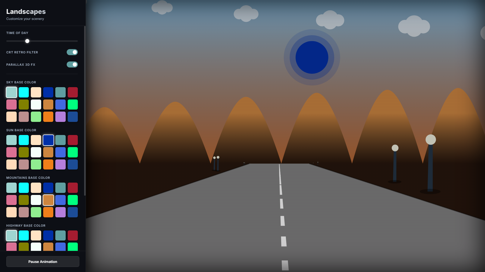
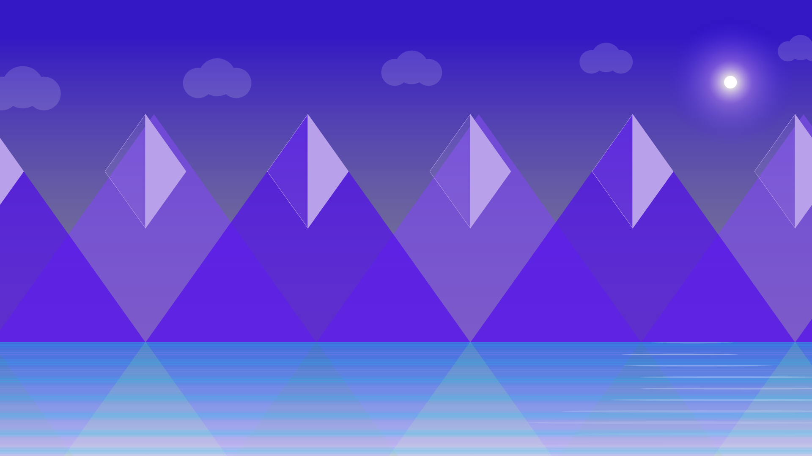
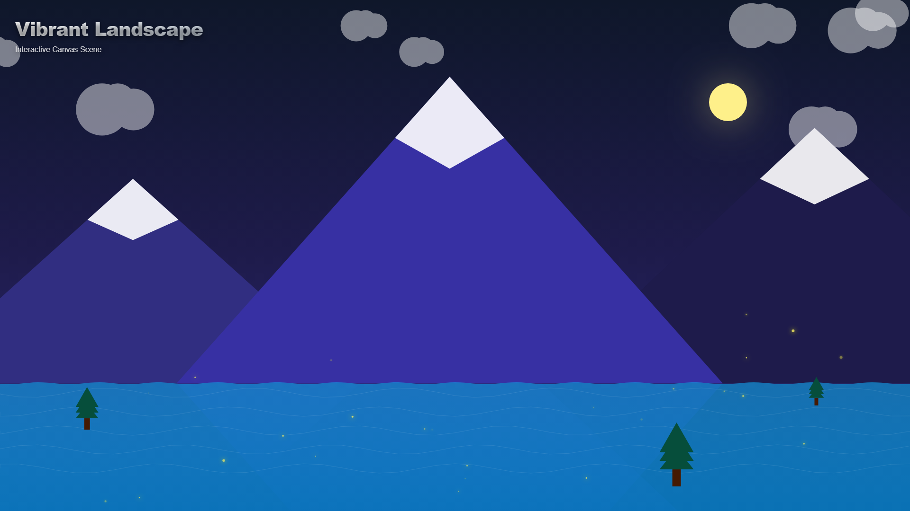
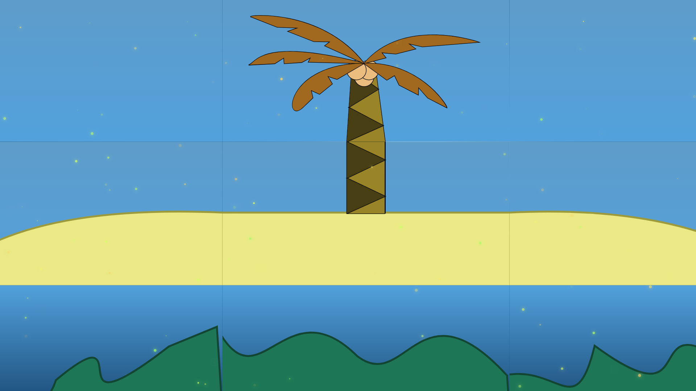

# Landscapes_Canvas 🎨
_Geometric designs based on natural landscapes using HTML5 `Canvas` and `JavaScript`._

## Starting 🚀
This project explores different landscape designs, all sharing a foundational geometric structure using `Canvas`. 
It has an aesthetic similarity with the project [0.9-HighWay-ColorStreet](https://github.com/Trex-Codes/0.9-HighWay-ColorStreet), utilizing similar rendering techniques.

## Deployments & Designs 🖼️
_Each design utilizes Canvas drawing contexts, applying intricate gradients and RGBA values to bring structures to life using pure JS._

### 1. Mountains Canvas
_A minimalist landscape structure featuring five mountains, each with top decorations and unique color gradients, set above a stylized water gradient._

### 2. Forest Canvas
_A more specialized and complex landscape. It features both straight and curved mountains, varied tree shapes and sizes, and a small lake at the bottom. All colors are crafted via gradients._

### 3. Sea Island
_An island context giving each element a specific characteristic within the website. The design is based on a 3x3 puzzle structure composed of a small reef, a sand island, and finally a palm tree._

